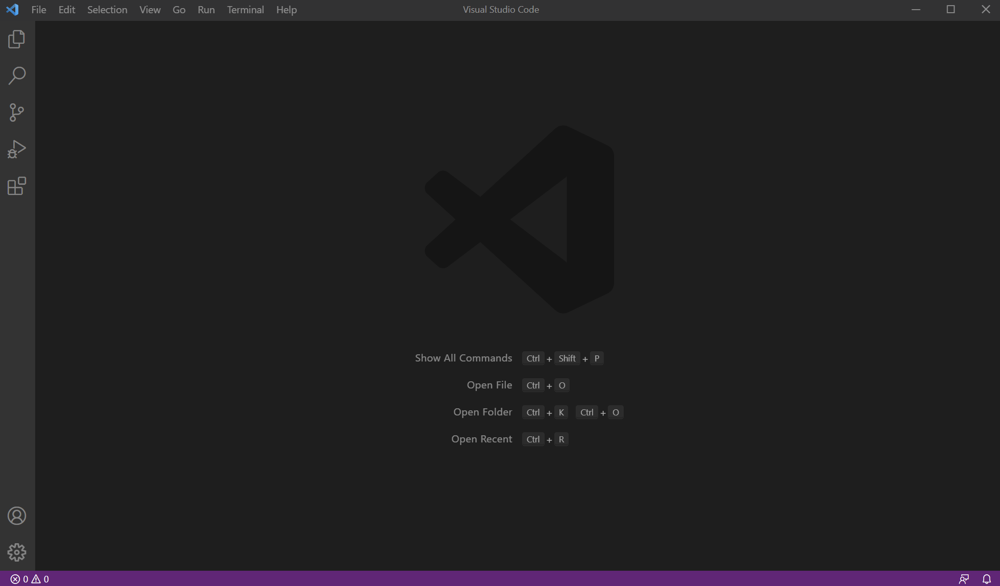
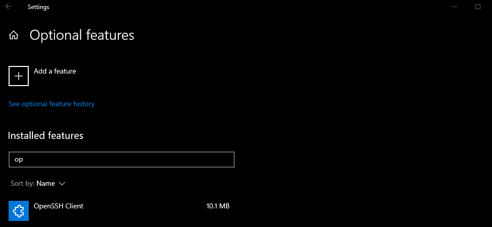
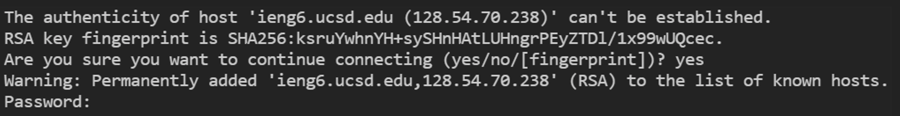
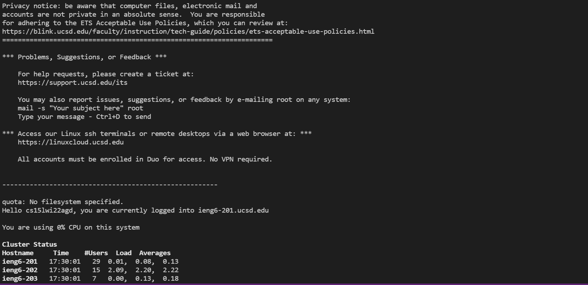
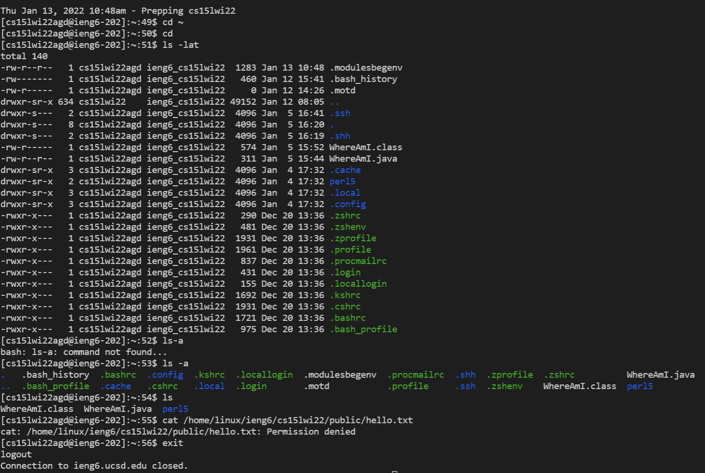
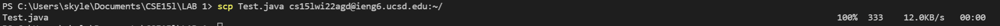
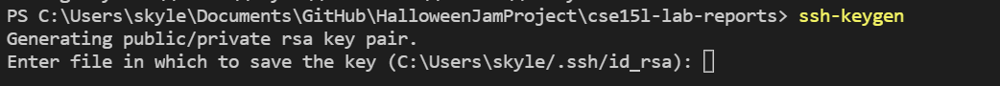
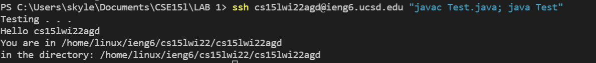

<h1 align="center">
Week 2 Lab Report
</h1>
<h3 align= "center"> 
A tutorial on remote access to ieng6 
</h3>

<div style = "padding: 1em;">
</div>

### **Part 1: Visual Studio Code**

<div style = "padding: 1em;">
</div>

Start by downloading Visual Studio Code by following the instructions at their website [Here](https://code.visualstudio.com/).
Once done downloading or if you have already downloaded Visual Studio Code, run it.

<div style = "padding: 1em;">
</div>



<div style = "padding: 1em;">
</div>

It should appear simialr to this screenshot. Do not worry if yours is in a different color since in this screenshot I have a theme applied. 

<div style = "padding: 1em;">
</div>

### **Part 2: OpenSSH**

<div style = "padding: 1em;">
</div>

 Next if you are on Windows, go to Settings > Apps > Apps & features > Optional features and search if you have OpenSSH Client installed. If not click add a feature at the top, and install OpenSSH.

<div style = "padding: 1em;">
</div>



<div style = "padding: 1em;">
</div>

If you are having trouble you can see additional information on the Microsoft website on how to install [OpenSSH](https://docs.microsoft.com/en-us/windows-server/administration/openssh/openssh_install_firstuse).

<div style = "padding: 1em;">
</div>

### **Part 3: Remote Connecting**

<div style = "padding: 1em;">
</div>

In Visual Studio Code, open a terminal (The command is Ctrl or Command + `). There is also button at the top right called Terminal. Highlight over it and click New Terminal in the menu options. 

<div style = "padding: 1em;">
</div>

In the terminal type in the command below where *** is you own specific letters in your course account which if you do not know can be found 
[at this ucsd website](https://sdacs.ucsd.edu/~icc/index.php).

<div style = "padding: 1em;">
</div>

```
ssh cs15lwi22***@ieng6.ucsd.edu
```

<div style = "padding: 1em;">
</div>

After you have typed that command, you might get a message like this if it is your first time logging into this server.



Type yes when prompted 

```
Are you sure you want to continue connecting(yes/no/[fingerprint])?
```

Similar to what is in the screenshot above and then type your password when prompted. This password is your course specific account password. 



You should see something like this.

<div style = "padding: 1em;">
</div>

### **Part 4: Running some commands**

<div style = "padding: 1em;">
</div>

Try running some commands on server and on your own computer.

Here are some commands:

* cd ~
* cd
* ls -lat
* ls -a
* ls <directory> where <directory> is /home/linux/ieng6/cs15lwi22/cs15lwi22abc, where the abc is one of the other group members’ username
* cp /home/linux/ieng6/cs15lwi22/public/hello.txt ~/
* cat /home/linux/ieng6/cs15lwi22/public/hello.txt



To exit from the server back to your own computer simply type ```exit``` into the command line.

<div style = "padding: 1em;">
</div>

### **Part 5: Moving files over SSH with scp**

<div style = "padding: 1em;">
</div>

A key command needed when working on local and remote computers is the ability to copy files back and forth bewtween computers as well as running them on either. 

First to copy files over we use the command ```scp```

Create a test file called ```Test.java``` and put the following code in it:

```
class Test {
    public static void main (String[] args) {
        System.out.println("Testing . . . ");
        System.out.println("Hello " + System.getProperty("user.name"));
        System.out.println("You are in " + System.getProperty("user.home") +
        "in directory: "+ System.getProperty("user.dir"));
    }
}
```

Start by first running Test.java on your computer. Then type in the command:

```
scp Test.java cs15lwi22***@ieng6.ucsd.edu:~/
```



In which you would get something like this if the command was typed correctly.

Type ```ls``` to ensure that the file was copy over. 

Then you can ```javac Test.java``` and ```java Test``` to see the results. The results on the server of Test.java should differ from the results on your own computer. 

<div style = "padding: 1em;">
</div>

### **Part 6: SSH keys**

<div style = "padding: 1em;">
</div>

To make life easier, we can skip typing our passwords into the command line ever time we want to log into the server by setting up an SSH Key

Run ```ssh-keygen``` on your computer



Press enter for which file in which to save the key in or enter your own address. 
It will then prompt you for a passphrase in which you can just enter nothing.

Once the passphrase is entered it should generate some randomart image. 

Now we will copy the public id_rsa key to the .ssh directory of your user account on the server. First ssh into the server. Create a .ssh directory using the command mkdir .ssh and logout.

```
ssh cs15lwi22***@ieng6.ucsd.edu
Password:
#now on server
mkdir .ssh
```

Then on your computer type the command:

```
scp /Users/*YourName*/.ssh/id_rsa.pub cs15lwi22***@ieng6.ucsd.edu:~/.ssh/authorized_keys
```

The directory will be the one you stored the ssh key in. 

Now you should be able to ssh into the ieng6 servers without having to type your password. 

<div style = "padding: 1em;">
</div>

### **Part 7: Optimizing Remote Running**
<div style = "padding: 1em;">
</div>

To directly run commands on the server when ssh you can add commands at the end of the ssh command with quotations to run the commands directly on the server.



Here I was on my computer and I was able to ssh into the servers and run `Test.java` all in the same command line. 

In addition, when on the server you can use semi-colons to run multiple commands at once

```
javac Test.java; java Test
```

This will automatically compile and run `Test.java`

So now, we can run commands and ssh into servers with only a few keystrokes (Keystrokes include keys pressed on the keyboard and mouse clicks). 

To fully optimize and cut time down in logging into servers and running a java file, We can first copy 

```
ssh cs15lwi22***@ieng6.ucsd.edu
```
which should only take 3 keystrokes (1 mouse click to drag and highlight the command and 2 presses for ctrl + c to copy the command into our clipboard)

Then paste the command into the terminal and with the ssh key set up this part should only take another 3 keystrokes ( 2 presses for ctrl + v and 1 press for enter)

And voilà, you were able to log into the servers with only 6 total keystrokes.

In addition, if you wanted to run a file in the server, you could run commands in a similar fashion. 

First copy the command for example: (3 keystrokes)
```
javac Test.java; java Test
```
Then as you work on the file test, you can simply paste the command into the terminal to run quickly. (3 keystrokes)

After you have pasted and ran the command, to run the same commands again all you would have to do is press the up arrow on your keyboard. (1 keystroke)

So in total, we can log in and start running commands using around 13 keystrokes. (This might depend if you needed to type out a different command, but optimally remote access can be done in less than 20 keystrokes).